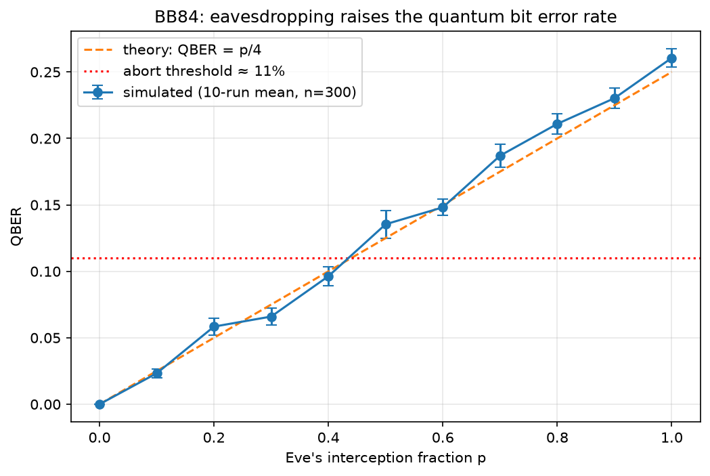

# QiskitBB84-E91
 BB84 & E91 Quantum Key Distribution in Qiskit

Working simulations of two QKD protocols — prepare-and-measure **BB84** (with an
intercept-resend eavesdropper) and entanglement-based **E91** (with a CHSH Bell-test
security check) — built in current Qiskit (primitives-based API, `AerSimulator`). The
aim is not just a running repo but one I can defend line-by-line: every gate choice
traces back to the physics, and the eavesdropper detection is verified quantitatively
against theory.

Background: my BSc dissertation covered the theory of BB84/E91 and QKD security
arguments. This project turns that theory into circuits.

## The protocol

**Encoding** (`protocols/bb84.py: encode_qubit`) — Alice draws a random bit and a random
basis (Z or X) per qubit. Starting from |0⟩, an X gate sets the bit value and a Hadamard
moves it into the X basis when chosen, giving the four BB84 states |0⟩, |1⟩, |+⟩, |−⟩.

**Measurement** (`measure_qubit`) — Bob picks his own random basis per qubit. Measuring
in X is implemented as H-then-measure-in-Z, using H² = I: when Bob's basis matches
Alice's, his Hadamard undoes hers and the outcome is deterministic (Born rule
probability 1). When bases differ, the outcome is 50/50 — |⟨0|+⟩|² = ½.

**Sifting** (`sift`) — Alice and Bob publicly compare bases only, *after* Bob has
measured, and discard mismatched positions (~50% survive, binomially distributed).
The timing matters: announcing bases first would let an eavesdropper measure in the
correct basis every time, gaining the key with zero disturbance.

On a clean channel the sifted keys agree exactly.

## The attack and its signature

**Intercept-resend** (`attacks/intercept_resend.py`) — Eve measures each intercepted
qubit in a randomly guessed basis and resends a fresh qubit prepared as whatever she
observed. She cannot do better: the no-cloning theorem forbids copying an unknown
state. Sketch: if a unitary cloned both |0⟩ and |1⟩, linearity forces
|+⟩⊗|0⟩ → (|00⟩+|11⟩)/√2, a Bell state — but a true clone would be
|+⟩⊗|+⟩ = (|00⟩+|01⟩+|10⟩+|11⟩)/2. Contradiction. Known orthogonal states copy fine
(a CNOT does it); it is Eve's ignorance of the basis that makes BB84's states
uncloneable in practice.

**QBER = p/4** — three independent events must line up to corrupt one sifted bit:

P(error) = P(intercept) × P(Eve wrong basis) × P(Bob's outcome flips) = p × ½ × ½ = p/4

At full interception (p = 1) the expected QBER is 25%. The sweep in
`analysis/qber_plots.py` confirms it:



Simulated points (10-trial means, n = 300, error bars = SEM) track the theoretical
p/4 line. The dotted line marks the ≈11% abort threshold used in security proofs.

## E91: entanglement-based QKD

BB84 sends prepared states; **E91** (`protocols/e91.py`) instead shares an entangled
Bell pair |Φ⁺⟩ = (|00⟩ + |11⟩)/√2 and lets *measurement* create the correlations. There
is no key to steal in transit — it does not exist until Alice and Bob measure.

**Bell pair** (`make_bell_pair`) — a Hadamard puts Alice's qubit into superposition and a
CNOT entangles it with Bob's, so their outcomes are perfectly correlated when measured
along the same axis.

**Measurement** (`measure_pair`) — each side randomly picks one of three angles (an RY
rotation about the y-axis, moving the measurement axis in the x-z plane). Alice and Bob
share one overlapping angle, so some rounds are measured along the *same* axis and some
along *different* axes.

**Two uses for the results:**
- **Key rounds** — where the two chose the same angle, their bits are perfectly
  correlated on an honest channel, giving shared key bits.
- **CHSH rounds** — where the angles differ, the results feed the Bell test. The
  correlation function E(a, b) = ⟨v_a·v_b⟩ (bits mapped to ±1 eigenvalues) is combined
  into S = E(0,0) − E(0,2) + E(2,0) + E(2,2). Quantum mechanics predicts |S| ≈ 2√2 ≈
  2.83, beyond the classical limit of 2 that any local-hidden-variable theory obeys.

**The security signature** — an eavesdropper (`measure_pair_with_eve`) intercepts Bob's
qubit mid-flight, measures along her own guessed angle, and resends. That measurement
collapses the entanglement, so her disturbance shows up two ways: key agreement drops,
and the CHSH value S is dragged back down towards the classical bound of 2. A running
Bell violation (|S| > 2) is itself the certificate that no one is listening.

```bash
python -m protocols.e91              # honest run, then p = 0.5 and p = 1 interception
```

## Statistical honesty

A single run at p = 1 gave QBER = 0.286 on a 56-bit sifted key. That is not a
discrepancy: σ = √(q(1−q)/N) = √(0.25 × 0.75 / 56) ≈ 0.058, so 0.286 sits ~0.6σ from
theory — unremarkable. For a deviation of that size to be significant at 3σ you would
need N ≈ q(1−q)/(0.036/3)² ≈ 1,300 sifted bits. This is exactly the trade real QKD
systems face: estimating QBER costs key material, and statistical power sets how much.

## Design decisions

- **One circuit per qubit, `shots=1`** — a real receiver measures each transmitted
  qubit exactly once. Batching or multi-shot statistics would be faster but would
  simulate statistics *about* BB84 rather than the protocol itself.
- **Current Qiskit API** — `transpile` + `sim.run`; the deprecated `execute()` used in
  older tutorials no longer runs.
- **`protocols/` never imports `attacks/`** — the protocol exists independently of any
  attack; Eve is injected by the runner via a local import (which also breaks the
  circular dependency).
- **Classical randomness from NumPy, quantum randomness from measurement** — Alice's
  bits and everyone's basis choices are classical coin flips; the only quantum
  randomness is the Born rule at measurement. (In simulation even that is pseudorandom;
  on hardware it is believed fundamentally irreducible.)
- **Seeded RNG (42)** for reproducible figures.

## What BB84 actually promises

Not that Eve cannot listen — that she cannot listen *without leaving evidence*.
Information gain forces disturbance; disturbance is measurable as QBER. Alice and Bob
either obtain a key Eve provably knows almost nothing about, or they abort having lost
nothing but qubits — Eve's ~75%-correlated transcript points at a key that no longer
exists. The abort is not a failure mode; it is the security working.

## Run it

```bash
python -m venv .venv
source .venv/Scripts/activate      # Git Bash on Windows; use activate.bat in cmd
pip install -r requirements.txt

python -m protocols.bb84           # clean channel vs full interception
python -m analysis.qber_plots      # regenerate the sweep figure
```

## Repo structure

```
protocols/bb84.py            core protocol: encode, measure, sift, QBER, runner
protocols/e91.py             entanglement-based QKD: Bell pairs + CHSH violation test
attacks/intercept_resend.py  Eve: measure in guessed basis, resend collapsed state
analysis/qber_plots.py       QBER vs interception-fraction sweep (saves PNG)
check_setup.py               environment sanity check (H on |0> gives ~50/50)
stage1_bases.py              basis-mismatch experiment (H^2 = I demonstration)
```

## Next steps

- Realistic channel noise and the QBER noise floor
- Privacy amplification / error correction sketch
